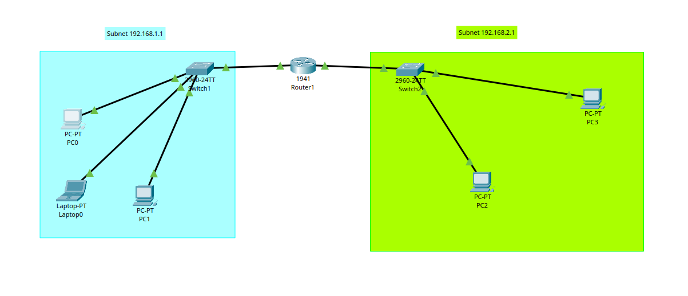
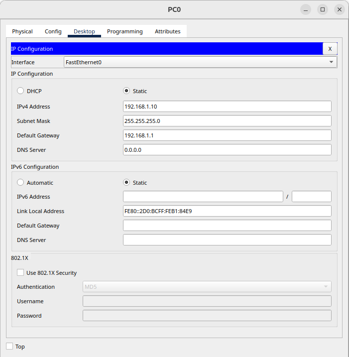
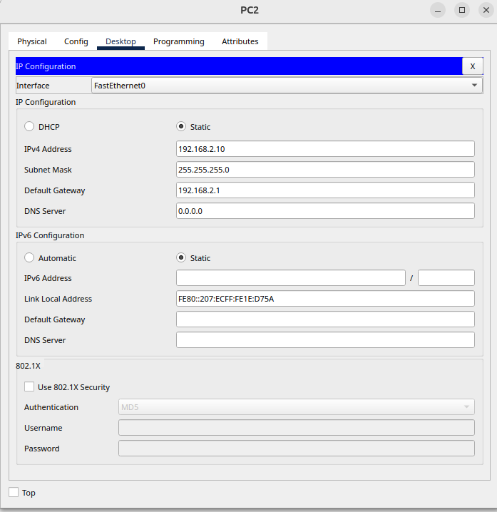
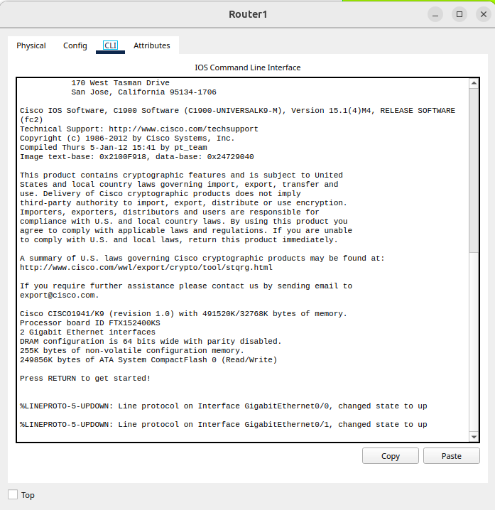
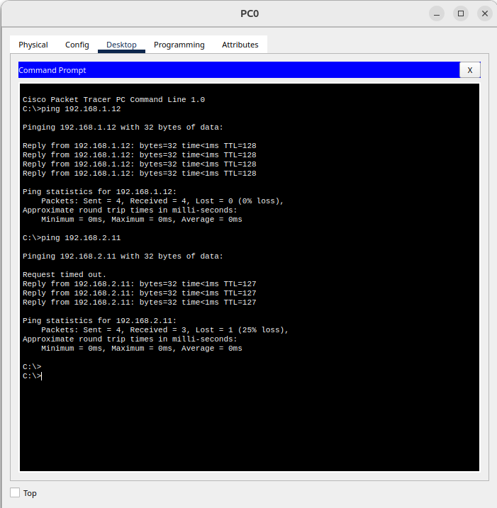
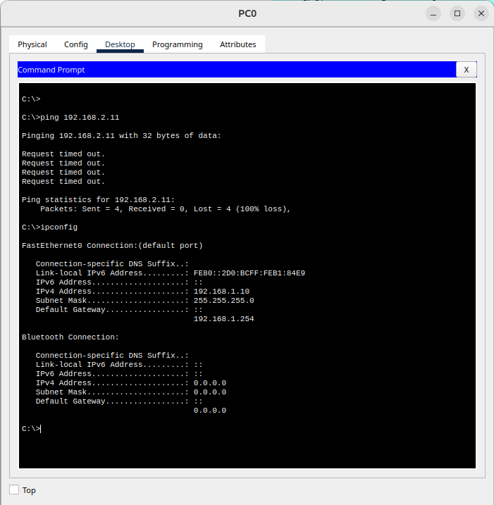
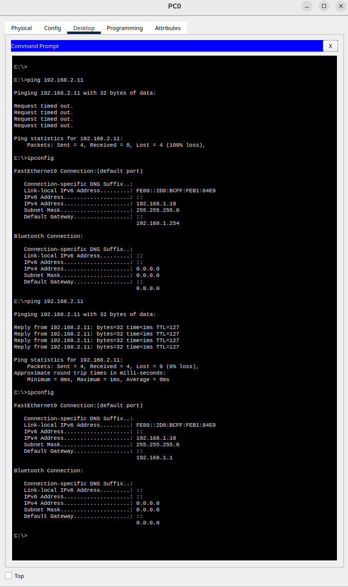

# Multi-Subnet Home Network Lab

## Overview
This project simulates a small home/office network using Cisco Packet Tracer.  
It includes two separate subnets connected via a router, allowing devices on different networks to communicate.

The lab focuses on building a working network, testing connectivity, and troubleshooting common configuration issues.

---

## Network Topology
This shows the full lab setup, including both subnets, switches, and the router connecting them.


The network consists of:

- 1 Router (Cisco 1941)
- 2 Switches (2960)
- Subnet 1: 3 devices (2 PCs + 1 laptop)
- Subnet 2: 2 PCs

- Subnet 1: `192.168.1.0/24`
- Subnet 2: `192.168.2.0/24`

Devices in each subnet connect to a switch, which connects to the router.

---

## IP Addressing

### Subnet 1 (192.168.1.0/24)
| Device   | IP Address     | Gateway        |
|----------|---------------|----------------|
| PC0      | 192.168.1.10  | 192.168.1.1    |
| PC1      | 192.168.1.11  | 192.168.1.1    |
| Laptop0  | 192.168.1.12  | 192.168.1.1    |

### Subnet 2 (192.168.2.0/24)
| Device | IP Address     | Gateway        |
|--------|---------------|----------------|
| PC2    | 192.168.2.10  | 192.168.2.1    |
| PC3    | 192.168.2.11  | 192.168.2.1    |

### Example IP Configuration (Subnet 1)
Example of a device configured in the 192.168.1.0/24 network with the correct default gateway.


### Example IP Configuration (Subnet 2)
Example of a device configured in the 192.168.2.0/24 network with the correct default gateway.


---

## Router Configuration
The router is configured with two interfaces, each acting as the default gateway for its respective subnet.


```text
enable
configure terminal

interface g0/0
ip address 192.168.1.1 255.255.255.0
no shutdown

interface g0/1
ip address 192.168.2.1 255.255.255.0
no shutdown

---

### Successful Connectivity Between Subnets
Ping test showing successful communication between devices on different subnets.


---

### Failed Ping (Incorrect Default Gateway)
Ping failure caused by an incorrectly configured default gateway.


---

### Connectivity Restored After Fix
After correcting the default gateway, communication between subnets is restored.

